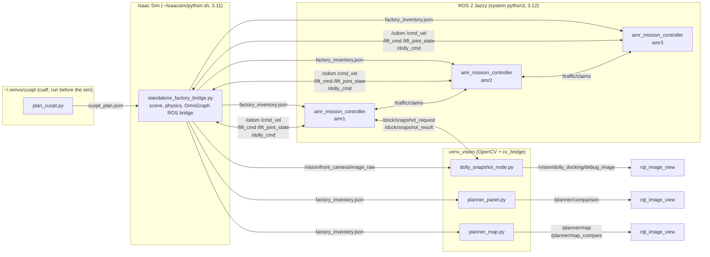
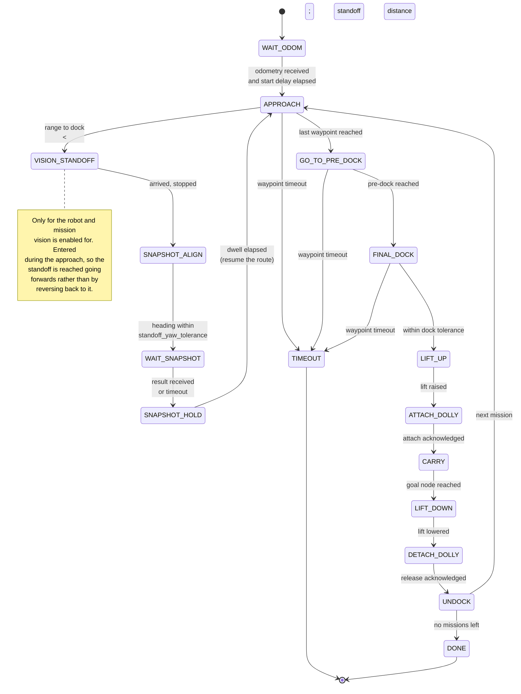
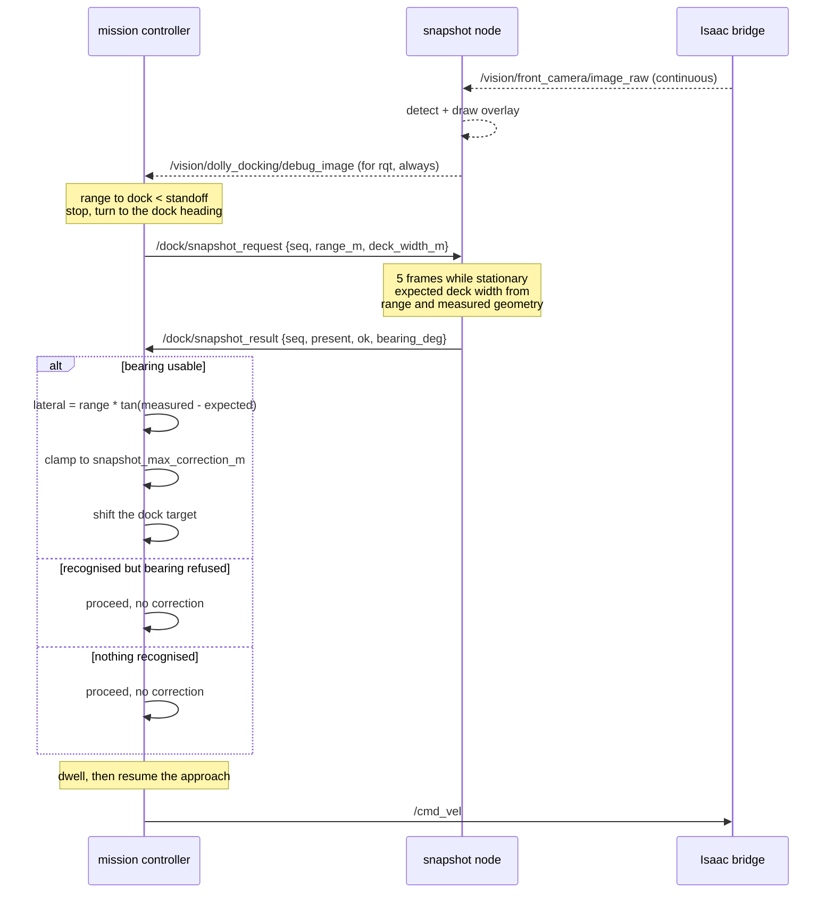
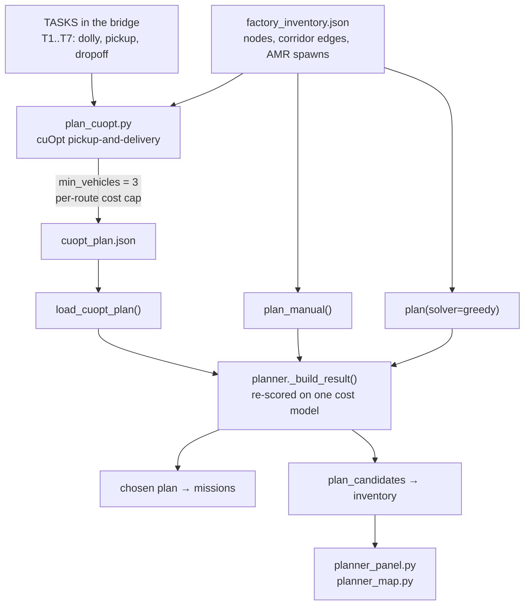

# Architecture

Diagrams of what runs where, how the robots are controlled, and how a
recognition result reaches the wheels. Written in Mermaid so they render on
GitHub and stay next to the code that has to match them.

---

## 1. Processes and interfaces

Four Python interpreters are involved, and they cannot be merged. Isaac Sim
ships its own 3.11; ROS 2 Jazzy uses the system 3.12; the vision node needs
OpenCV and `cv_bridge` together; cuOpt needs `cudf`, which will not sit beside
Isaac's CUDA stack. Everything therefore talks over ROS 2 topics or files.

Two things worth noting because they are easy to misread.

**The bridge is not an rclpy node.** Its ROS interface is an OmniGraph built
inside Isaac Sim, which is why `ros2 topic list` can come back empty while
topics are publishing normally. Use `ros2 topic hz /odom` to check it.

**cuOpt runs before the simulation, not during it.** The assignment is solved
into a file and read at startup. That is a consequence of the interpreter
split, not a design preference.

---

## 2. Mission controller state machine

One instance per robot, each independent. There is no central executive issuing
motion commands: the fleet coordinates only through `/traffic/claims`, so
losing one controller stops one robot rather than the fleet.

The bracketed vision states are skipped entirely when vision is off, and the
remaining path is the coordinate-only sequence that has always worked. That is
deliberate: vision is layered on top of a working dock, never in place of it.

---

## 3. How a recognition reaches the wheels

The controller stops, asks once, and applies a bounded correction. It is not a
control loop.

### Why the answer is split in two

`present` and `ok` are reported separately because the two questions have very
different reliabilities.

| Question | Field | Measured rate | Used for |
|---|---|---|---|
| Is a Dolly there? | `present` | 99% with a Dolly in view | Confirming the approach |
| Is the bearing steerable? | `ok` | roughly a third of snapshots | A clamped trim only |

Reporting one combined number would hide which half failed. It would also
overstate what vision contributes: bearing error has a standard deviation of
2.6 degrees, which is 0.14 m at 3 m, against a coordinate dock that already
achieves 0.11 m. Applied unclamped, corrections of −0.34 m and −0.59 m were
observed on individual snapshots; either would have missed the Dolly.

---

## 4. Planning

### Why cuOpt rather than the exhaustive solver

Not for speed or route quality. For seven tasks and three robots the
exhaustive solver in `mission_planner.py` returns an optimal makespan in under
2 ms, and cuOpt cannot beat optimal.

It is used because it can express constraints the others cannot. Asked only to
minimise distance, with no return trip, cuOpt gave all seven tasks to one robot
at 314.6 m — genuinely minimal, and useless as a fleet. `set_min_vehicles` and
`set_vehicle_max_costs` turn it into the 3/2/2 split the scenario calls for,
and neither is expressible in a solver that only minimises makespan.

Every candidate is re-scored through `planner._build_result` before comparison,
so the panel is not comparing one solver's arithmetic against another's, and a
stale plan file referencing tasks this run does not have fails loudly instead
of producing a plausible number.

---

## 5. Technology stack

| Layer | Choice | Note |
|---|---|---|
| Simulation | Isaac Sim 5.x | Factory USD, PhysX, RTX camera |
| Middleware | ROS 2 Jazzy, Fast DDS | Domain 130, whitelist profile |
| Fleet control | Per-robot FSM + claim-based traffic locking | No central executive |
| Task assignment | NVIDIA cuOpt (pickup-and-delivery) | Solved offline into JSON |
| Baselines | Exhaustive, greedy, manual | Same cost model, for comparison |
| Perception | HSV deck segmentation with geometric gates | Snapshot, not a loop |
| Camera model | Calibrated from rendered frames | fx measured, not requested |
| Visualisation | ROS image topics, `rqt_image_view` | Overlay, plan bars, factory map |

### On the camera model

The intrinsics file describes the lens rather than configuring it. Two attempts
to widen the field of view from that file both failed silently — the renderer
kept the authored optics while every consumer believed otherwise, which made a
Dolly appear 2.6 times larger than predicted and put bearings out by up to 35
degrees. Measuring `fx` off rendered frames against the Dolly's known 1.242 m
deck, and writing that measurement back, reduced bearing error from a standard
deviation of about 19 degrees to 2.6.
