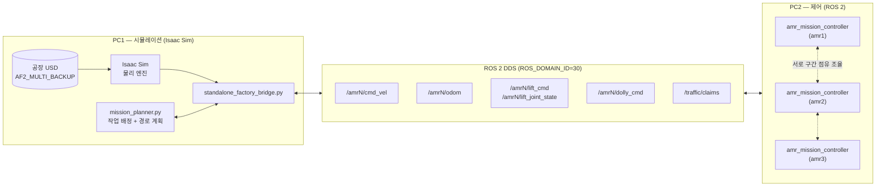
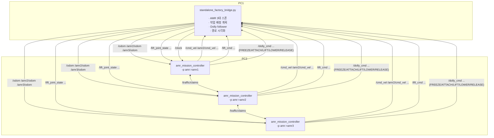
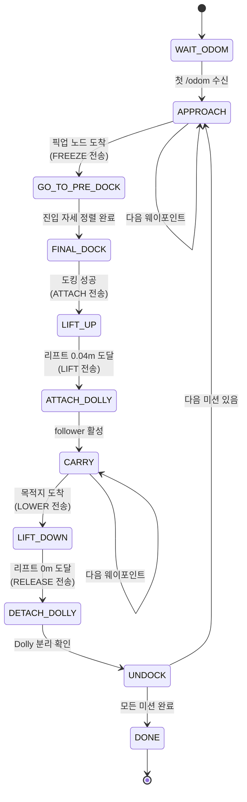
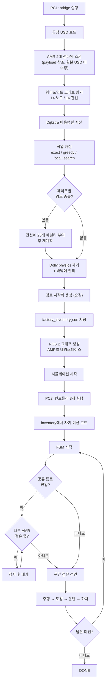

# 시스템 아키텍처 및 동작 원리

Multi-AMR Dolly 운송 디지털 트윈. Isaac Sim으로 공장을 시뮬레이션하고,
ROS 2로 분리된 두 대의 PC가 로봇 3대를 조율합니다.

---

## 1. 한 장으로 보는 전체 구조



**핵심 원칙**: PC1은 "몸(물리)", PC2는 "머리(판단)". 둘 사이는 오직 ROS 2 토픽으로만
대화합니다. 파일을 주고받지 않기 때문에 실제로 두 대의 컴퓨터로 분리할 수 있습니다.

---

## 2. 왜 이렇게 나눴는지 (쉬운 설명)

로봇 시스템을 만들 때 가장 흔한 실수는 **"시뮬레이터가 다 하게" 만드는 것**입니다.
그러면 시뮬레이터를 실제 로봇으로 바꾸는 순간 전부 다시 짜야 합니다.

그래서 이렇게 나눴습니다.

| | 담당 | 실제 로봇으로 바꿀 때 |
|---|---|---|
| PC1 | 물리, 센서, 로봇 몸체 | **통째로 교체됨** (실제 로봇/공장) |
| PC2 | 어디로 갈지, 언제 들어올릴지 판단 | **그대로 재사용** |

PC2의 제어 코드는 "이게 시뮬레이션인지 실제인지" 모릅니다. `/odom`으로 위치를 받고
`/cmd_vel`로 속도를 내보낼 뿐입니다. 이게 ROS를 쓰는 진짜 이유입니다.

---

## 3. 노드와 토픽 상세



### 토픽 목록

| 토픽 | 타입 | 방향 | 역할 |
|---|---|---|---|
| `/{ns}/cmd_vel` | `geometry_msgs/Twist` | PC2 → PC1 | 주행 속도 명령 |
| `/{ns}/odom` | `nav_msgs/Odometry` | PC1 → PC2 | 로봇 위치·자세 |
| `/{ns}/lift_cmd` | `sensor_msgs/JointState` | PC2 → PC1 | 리프트 높이 목표 |
| `/{ns}/lift_joint_state` | `sensor_msgs/JointState` | PC1 → PC2 | 리프트 실제 높이 |
| `/{ns}/dolly_cmd` | `sensor_msgs/JointState` | PC2 → PC1 | Dolly 조작 명령 |
| `/traffic/claims` | `std_msgs/String` (JSON) | PC2 ↔ PC2 | 통로 점유 조율 |
| `/clock` | `rosgraph_msgs/Clock` | PC1 → PC2 | 시뮬레이션 시각 |

`{ns}`는 amr1이 빈 문자열, amr2·amr3은 각각 `amr2`, `amr3`입니다.

### Dolly 명령 프로토콜

`/dolly_cmd`는 `position = [명령코드, 시퀀스번호]`로 보냅니다.

| 코드 | 명령 | 시점 |
|---|---|---|
| 1 | FREEZE | 픽업 노드 도착, Dolly 고정 |
| 2 | ATTACH | 도킹 완료, Dolly를 AMR에 부착 |
| 3 | LIFT | 리프트 상승과 동기 |
| 4 | LOWER | 목적지 도착 |
| 5 | RELEASE | 하강 완료 후 분리 |

> **주의** — `ROS2SubscribeJointState` 노드는 `name`과 `position` 배열 길이가
> 다르면 메시지를 조용히 버립니다. 그래서 `name`도 2개(`dolly_cmd`, `dolly_seq`)를
> 넣습니다. 이걸 몰라서 명령이 전부 무시되는데도 컨트롤러는 정상 진행하는
> "가짜 성공"을 한 번 겪었습니다.

---

## 4. 미션 상태 머신 (FSM)

각 AMR 컨트롤러가 도는 상태 흐름입니다. 코드의 `control_loop()`와 1:1 대응합니다.



### 속도 정책

| 구간 | 직진 | 회전 | 이유 |
|---|---|---|---|
| APPROACH / CARRY | 4.05 m/s | 6.30 rad/s | 이동 시간 단축 |
| FINAL_DOCK | 0.36 m/s | 0.75 rad/s | 정밀 진입, 오차 10cm 이내 |
| UNDOCK | 0.50 m/s (후진) | — | Dolly에서 안전하게 빠져나옴 |

---

## 5. 전체 실행 플로우차트



---

## 6. 핵심 컴포넌트 설명

### 6-1. 작업 배정 (`mission_planner.py`)

"어느 로봇이 어떤 작업을, 어떤 순서로 할지" 정하는 부분입니다.
표준 라이브러리만 써서 PC1·PC2 양쪽에서 쓸 수 있습니다.

```
WaypointGraph   공장 지도 → Dijkstra 최단경로
Task            "Dolly A를 노드10에서 노드12로"
Vehicle         "amr1은 노드10에서 시작"
plan(solver=)   배정 결과
```

솔버는 갈아끼울 수 있습니다.

| 솔버 | 방식 | 언제 |
|---|---|---|
| `exact` | 분기한정 완전탐색 | 작업 8개 이하, 최적해 보장 |
| `local_search` | 그리디 + 재배치/교환 | 대규모 |
| `greedy` | 최근접 배정 | 비교 기준 |
| `manual` | 사람이 지정 | 비교 기준 |

### 6-2. 경로 충돌 회피 (2단계 방어)

**1단계 — 계획 시 회피.** 먼저 계획된 로봇이 쓰는 간선에 25배 페널티를 걸고
다음 로봇의 경로를 다시 계산합니다. 우회로가 있으면 알아서 피해 갑니다.

**2단계 — 런타임 조율.** 그래도 겹치는 통로가 남으면 `/traffic/claims`로
서로 점유 상태를 알립니다. 먼저 잡은 쪽이 우선이고, 동시에 원하면 이름 순으로
양보합니다.

> 이 공장 그래프는 14개 노드 중 10개가 차수 2라 사실상 **하나의 순환로**입니다.
> 전수 탐색으로 확인한 결과, 특정 작업 조합에서는 경로 완전 분리가
> **수학적으로 불가능**했습니다. 그래서 2단계 방어가 필요합니다.

### 6-3. Dolly 운반 (물리 대신 follower)

Dolly는 PhysX **articulation**(링크 9개 + 조인트 8개)입니다. 처음엔 FixedJoint로
실제로 들어 올리려 했지만 실패했습니다.

- articulation 링크는 `rigidBodyEnabled=False`를 무시합니다
- 매 프레임 root를 강제 이동시키면 솔버와 충돌해 **AMR이 바닥을 뚫고 튕겨 나갔습니다**
  (`z = -374074 m`까지 자유낙하)

그래서 방식을 바꿨습니다. 시뮬레이션 시작 **전에** Dolly의 physics 스키마만
제거해 순수 렌더링 객체로 만들고, 매 프레임 chassis 기준 상대 위치로 좌표를
갱신합니다. 메시와 재질은 그대로라 화면에는 정상으로 보입니다.

```
T_world_dolly = T_chassis_dolly_carry × T_world_chassis
```

### 6-4. 런타임 환경 보정

원본 USD를 수정하지 않고 런타임에만 두 가지를 보강합니다.

| 문제 | 조치 |
|---|---|
| 바닥 충돌체가 `x ≤ -17.25`에만 존재 (Node3 등 목적지 절반이 바닥 없음) | 보이지 않는 무한 평면 collider 추가 (마찰 0.9) |
| Dolly가 원본에서 바닥보다 28.13cm 떠 있음 | 시작 시 최저점을 바닥에 안착 |

---

## 7. 파일 구조

```
cobot3_project2/
├── simulation/isaac_sim/
│   ├── standalone_factory_bridge.py    PC1 메인 (시뮬레이션 + ROS 브리지)
│   ├── mission_planner.py              작업 배정 (PC1/PC2 공용)
│   ├── benchmark_planner.py            솔버 성능 비교 (재현 가능)
│   ├── factory_inventory.json          PC1이 생성 → PC2가 읽음
│   ├── Collected_AF2_FLAT/             공장 USD 에셋
│   └── vision_docking/                 YOLO 비전 도킹 (현재 미사용, 보존)
├── ros2_ws/src/
│   ├── amr_control/                    PC2 미션 컨트롤러
│   └── interfaces/                     서비스 정의
└── docs/
    ├── system_architecture.md          이 문서
    ├── presentation_guide.md           발표 가이드
    └── planner_benchmark.md            cuOpt 벤치마크 결과
```

---

## 8. 실행 방법

경로는 스크립트 위치 기준으로 자동 해석되므로 **어디에 clone 해도 동작**합니다.

### PC1
```bash
cd <저장소>
source /opt/ros/jazzy/setup.bash
export ROS_DOMAIN_ID=30
export HEADLESS=0                      # 1이면 창 없이 고속 실행
~/isaacsim/python.sh simulation/isaac_sim/standalone_factory_bridge.py
```
`BRIDGE RUNNING`이 나올 때까지 대기 (약 60~110초). 이때
`factory_inventory.json`이 생성됩니다.

### PC1 → PC2 (씬이 바뀔 때 1회)
```bash
scp simulation/isaac_sim/factory_inventory.json <PC2>:<저장소>/simulation/isaac_sim/
```

### PC2
```bash
cd <저장소>/ros2_ws
source /opt/ros/jazzy/setup.bash
colcon build --packages-up-to amr_control    # 최초 1회
source install/setup.bash
export ROS_DOMAIN_ID=30

ros2 run amr_control amr_mission_controller --ros-args -p amr:=amr1 &
ros2 run amr_control amr_mission_controller --ros-args -p amr:=amr2 &
ros2 run amr_control amr_mission_controller --ros-args -p amr:=amr3 &
```

### 네트워크 요건
- 양쪽 `ROS_DOMAIN_ID=30` 일치
- 같은 서브넷, UDP 7400~7500 개방 (DDS discovery)
- ROS 2 Jazzy, RMW 구현 일치 (기본 FastDDS)

---

## 9. 기술 스택

| 계층 | 사용 기술 |
|---|---|
| 시뮬레이션 | NVIDIA Isaac Sim 5.1, PhysX, USD |
| 미들웨어 | ROS 2 Jazzy, FastDDS |
| 시뮬-ROS 연결 | Isaac Sim OmniGraph ROS 2 Bridge |
| 경로 계획 | Dijkstra (자체 구현) |
| 작업 배정 | 분기한정 / 로컬서치 (자체), NVIDIA cuOpt 26.8 (벤치마크) |
| 비전 (보존) | YOLO Pose, OpenCV solvePnP |
| 언어 | Python 3.11 (Isaac) / 3.12 (ROS) |
